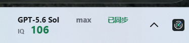
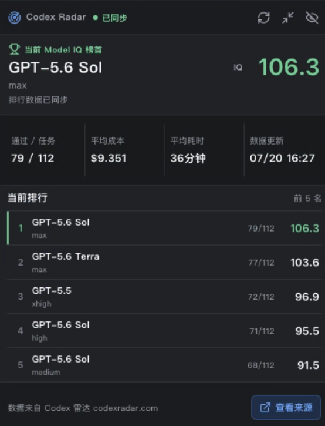
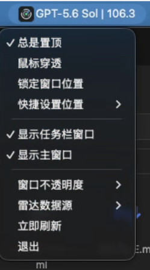

# Model Radar

Model Radar 是一个基于 Tauri 2、React 和 TypeScript 的 Windows/macOS 桌面小组件。它可在 Codex Radar 主站公开摘要与分布式实时榜单之间切换，在紧凑置顶窗口中显示所选来源当前 Model IQ 最高的模型，并可展开查看排名与数据详情。

## 界面预览







- Windows：在主任务栏通知区域左侧嵌入榜首模型与 IQ；点击打开详情，右键显示共享控制菜单。
- macOS：使用原生菜单栏状态项标题显示榜首模型与 IQ；点击打开详情，右键显示共享控制菜单。
- 主窗口会保存最后位置并在下次启动时恢复；显示器布局变化后会自动夹取到可见工作区。
- 控制菜单支持总是置顶、鼠标穿透、锁定位置、快捷设置到五个常用屏幕位置、主站/分布式雷达切换、窗口显隐、60%-100% 不透明度、立即刷新和退出。

数据源选择会保存在本机。主站继续以五分钟周期使用 ETag 检查更新；分布式榜单每分钟读取一次实时表，并使用 Last-Modified 避免重复下载。切换后会立即刷新，两个来源的缓存、校验器和榜首变化通知互不混用。

Windows 运行期间每秒重新计算一次任务栏空位。TrafficMonitor 等第三方任务栏窗口出现或移动后，组件会自动避让；没有完整空位时会关闭任务栏投影并恢复主窗口，可从右键菜单再次尝试开启。

首个版本不支持 Linux。Windows 当前只适配主显示器上的 Windows 11 任务栏；经典任务栏、副屏任务栏及 Explorer 重启后自动重建暂未支持。

## 使用说明

1. 从 [GitHub Releases](https://github.com/FingerCaster/codex-radar-desktop/releases) 下载当前平台安装包。macOS 用户选择 `Model.Radar_0.2.0_universal.dmg`，它同时支持 Apple Silicon（M 系列）和 Intel。
2. 启动后，macOS 会在菜单栏显示当前榜首模型与 IQ；Windows 会在主任务栏通知区域左侧显示同样的信息。
3. 点击菜单栏/任务栏小组件打开详情窗口，查看当前榜首、通过任务数、平均成本、平均耗时和前 5 名排行。
4. 右键小组件打开控制菜单，可切换数据源、立即刷新、调整窗口透明度、设置常用位置、显示或隐藏详情窗口。
5. 如果希望窗口固定在某个位置，先通过“快捷设置位置”放到目标区域，再启用“锁定窗口位置”。

## 本地开发

需要 Node.js 20.19 或更高版本、pnpm 10、Rust stable，以及当前平台的 [Tauri 2 系统依赖](https://v2.tauri.app/start/prerequisites/)。

```powershell
pnpm install --frozen-lockfile
pnpm tauri dev
```

仅调试 Web 前端时可运行 `pnpm dev`，但 Tauri 命令、系统托盘和原生通知只有在桌面进程中可用。

## 验证

```powershell
pnpm lint
pnpm typecheck
pnpm test
pnpm build
cargo fmt --manifest-path src-tauri/Cargo.toml --all -- --check
cargo clippy --manifest-path src-tauri/Cargo.toml --all-targets --all-features -- -D warnings
cargo test --manifest-path src-tauri/Cargo.toml
pnpm exec tauri info
pnpm tauri build
```

## 跨平台构建

```powershell
pnpm tauri build
```

Tauri 桌面安装包不是通用产物：Windows 安装包需在 Windows 构建，macOS 应用需在 macOS 构建。首个版本不构建 Linux 软件包。macOS 签名/公证和 Windows 签名不在当前 MVP 范围内。

## 数据来源与授权限制

- 主站模式只读取 Codex Radar 的公开摘要端点 `https://codex-reset-radar.pages.dev/current.json`（canonical mirror 为 `https://codexradar.com/current.json`），不调用需要授权的完整 API，也不抓取网页 HTML。
- 分布式模式读取 `https://api.codexradar.com/api/v1/table`，按网页默认的“每格最新有效结果”口径实时计算各模型/effort 的 IQ；详情来源链接固定指向 [deng.codexradar.com](https://deng.codexradar.com/)。它与主站的最新可发布结果口径不同，分数不保证一致。
- 排名数据、模型评测内容和来源署名归相应 Codex Radar 数据提供方所有；详情界面必须保留与当前来源匹配的链接及署名文本。
- 本仓库中的本地 MVP 不代表获得了数据再分发、商业使用或公开发布安装包的授权。公开分发前必须先取得数据提供方要求的授权，并再次核对其最新条款。
- 不得移除、隐藏或弱化来源署名，也不得把上游数据标注为本项目自行测得。

当前版本不包含自动更新、遥测、账号登录、安装包发布或签名流程。
